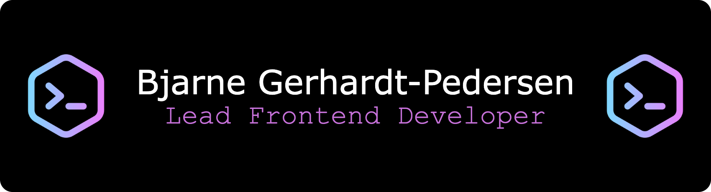

# Welcome to my GitHub profile

I'm <strong>Bjarne Gerhardt-Pedersen</strong> and I'm a <strong>Lead Frontend Developer</strong>
I have been developing web applications since 2011 and have a bachelor's degree in Web Development. I'm from Denmark, Copenhagen and currently working at [Visma Dinero](https://dinero.dk/).

Since 2015, I have worked professionally with web apps built in Google's open source web framework, Angular. I started my work in the now legacy AngularJS and subsequently in its successor, the modern web development platform, Angular, that we know today. It has given me extensive experience, expertise and knowledge in Angular and the related technologies by starting, further developing and maintaining several Angular web apps.

I closely follow developments within JavaScript, TypeScript and Angular and use it in my daily work.

## :hammer_and_wrench: Currently working with

- Frontend programming - JavaScript, TypeScript, HTML & SCSS
- Client-side frameworks - Angular
- Reactive Programming - RxJS
- State Management - NgRx
- Versioning - Git & GitHub
- Automated testing - Jest & Cypress
